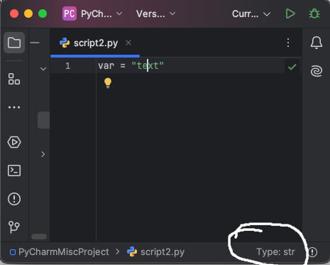

# PyCharm Plugin: PSI Type Widget



This plugin displays the type of a variable under the caret in the status bar of PyCharm.

## Installation

1. Clone this repository:

   ```bash
   git clone https://github.com/awerks/plugin.git
   cd plugin/plugin
   ```

2. Load the project into IntelliJ IDEA, Run the `buildPlugin` Gradle task to build the plugin

3. Locate the generated `.zip` file in the `build/distributions` directory.

4. Open PyCharm and navigate to `File > Settings > Plugins`.

5. Click on the gear icon and select `Install Plugin from Disk`.

6. Choose the `.zip` file and restart PyCharm.
